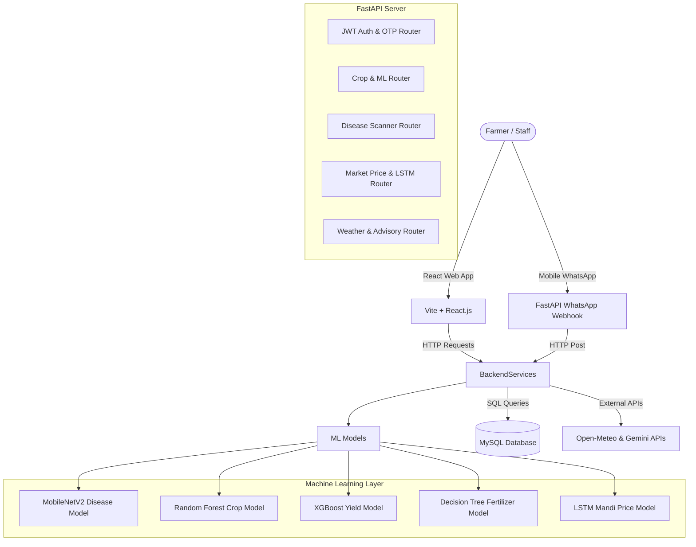
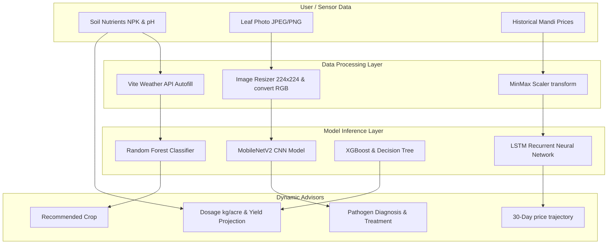

# 🌾 Krishik AI — Localized Intelligent Agronomist Platform

[](https://fastapi.tiangolo.com)
[](https://react.dev)
[](https://www.mysql.com)
[](https://www.tensorflow.org)
[](https://scikit-learn.org)
[](https://tailwindcss.com)

**Krishik AI (కృషిక్ AI)** is a premium, full-stack, AI-powered agronomist platform designed to support farmers in Telangana, India. By combining predictive machine learning models, deep learning visual diagnostics, real-time meteorological indicators, market intelligence, and WhatsApp integrations, Krishik AI serves as a 24/7 localized assistant to maximize yields, protect crops, and improve profit margins.

---

## 🌟 Key Features

### 1. 🚜 Interactive Dashboard
* **Dynamic Welcome Banner**: Displays farm size, soil composition, and primary irrigation sources configured in the profile.
* **Hyperlocal Weather Indicators**: Displays live temperature, relative humidity, wind speed, soil temperature, and soil moisture.
* **Smart Task Planner**: Auto-generates seasonal tasks (e.g. fertilizer split-dressing, heat mulching alerts, pre-rain warnings) based on registered crops and real-time weather.
* **Advisory Notifications**: Prioritized alerts for severe weather warnings, upcoming crop harvests, and market price spikes.

### 2. 🌾 Crop Lifecycle & ML Advisories
* **Random Forest Crop Recommender**: Analyzes soil nutrients ($N, P, K$, $pH$) and weather parameters (autofilled from weather API or entered manually) to recommend the most suitable crop from **22 supported varieties**.
* **XGBoost Yield Predictor**: Forecasts total yield in quintals based on farm acreage, crop type, soil type, and atmospheric coordinates.
* **Decision Tree Fertilizer Advisor**: Recommends fertilizer split-dosage schedules and volume (kg/acre) based on soil category, active growth phase, and nutrient deficiencies.
* **Lifecycle Tracker**: Interactive tracking boards displaying elapsed days and growth progress across 7 growth phases (Sowing $\rightarrow$ Harvested).

### 3. 📸 Deep Learning Plant Disease Scanner
* **Visual CNN Diagnosis**: Analyzes uploaded leaf photos using a fine-tuned MobileNetV2 CNN classifier to instantly diagnose **15 classes of crop diseases** (Paddy, Tomato, Potato, Pepper) with match confidence percentage.
* **Remedy & Action Guidelines**: Provides immediate biological and chemical treatment instructions in Telugu and English.
* **Expert Review Loop**: Connects farmers directly to agronomists. When a farmer uploads a scan, it populates the expert dashboard where certified agronomists review, verify, and add custom recommendations.

### 4. 💰 Mandi Price & Smart Arbitrage
* **LSTM Mandi Price Forecasting**: Predicts commodity prices up to 30 days ahead using a trained LSTM recurrent neural network.
* **Smart Arbitrage Calculator**: Dynamically calculates potential gross returns, transport costs, and net margins across 5 local mandis (Warangal, Suryapet, Nalgonda, Khammam, Hyd Bowenpally) to identify the most profitable market.

### 5. ☀️ Hyperlocal Weather & Irrigation Advisories
* **7-Day Outlook**: Graphical charts displaying temperature variations and rain probability using Open-Meteo.
* **Smart Irrigation Assistant**: Automatically analyzes evaporation rates and soil moisture thresholds to give clear irrigate/skip instructions in Telugu.

### 6. 🏛️ Government Schemes & Eligibility
* **Welfare Schemes Directory**: Comprehensive lookup for state (Rythu Bandhu, Rythu Bima, Rythu Vedika, TMIP) and central (PM-KISAN, PMFBY, KCC, e-NAM, PKVY) welfare benefits.
* **Dynamic Eligibility Calculator**: Computes whether a farmer qualifies based on age, patta land acreage, and caste category.

### 7. 💬 WhatsApp Integration (Meta Cloud & Twilio)
* **Interactive Menu Bot**: Farmers can interact with a structured menu to query weather, schemes, or check commodity prices.
* **Generative Ask AI**: Natural language questions are sent to the Gemini API with the farmer's registered crop and soil context pre-appended.
* **Snap & Diagnose**: Farmers can upload leaf images directly via WhatsApp. The webhook intercepts the image, passes it to the CNN classifier, saves the guest activity safely, and replies with the diagnosis text.

---

## 🏗️ Technical Architecture



## ⚙️ Data Flow & ML Pipelines

### 1. ML Model Inference Pipeline
This diagram shows how user inputs (soil metrics, leaf photos, historical mandi rates) are processed, scaled, and run through our ML/DL classifiers to generate dynamic agronomic outputs:



### 2. WhatsApp Message Webhook Processing
This diagram shows the asynchronous background processing pipeline that powers the Meta Cloud and Twilio WhatsApp chatbot interfaces:

```mermaid
sequenceDiagram
    autonumber
    actor Farmer
    participant WhatsApp as Meta/Twilio Cloud API
    participant Webhook as FastAPI Webhook Endpoint
    participant DB as MySQL Database
    participant ML as ML Models (CNN / LSTM)

    Farmer->>WhatsApp: Sends query (text or leaf image)
    WhatsApp->>Webhook: Sends HTTP POST (JSON Payload)
    Webhook-->>WhatsApp: Returns 200 OK (Immediate Handshake)
    
    rect rgb(30, 41, 59)
        note over Webhook, ML: Asynchronous Webhook Processing
        Webhook->>DB: Query sender mobile (farmer profile lookup)
        alt Message Type = Leaf Image
            Webhook->>WhatsApp: Downloads leaf image binary
            Webhook->>ML: Run CNN MobileNetV2 Inference
            ML-->>Webhook: Returns disease + treatment recommendation
            opt Farmer is Registered
                Webhook->>DB: Save DiseaseRecord (FK linked)
            end
        else Message Type = Text Question
            Webhook->>ML: Query LSTM for mandi price OR Gemini for agronomist tips
            ML-->>Webhook: Returns price forecast / chat response
        end
        Webhook->>DB: Write UserActivity log
        Webhook->>WhatsApp: Dispatch WhatsApp Message (POST)
    end
    WhatsApp->>Farmer: Delivery of advice/report on mobile
```



## 🧠 Machine Learning Core & Model Performance

Krishik AI relies on a dedicated suite of Machine Learning and Deep Learning models for agronomic and commercial forecasting. The details, algorithms, and validation metrics for each model are summarized below:

| Feature/Task | Model/Algorithm | Key Inputs | Output/Target | Performance Metrics |
| :--- | :--- | :--- | :--- | :--- |
| **Crop Recommendation** | **Random Forest Classifier** | Soil $N, P, K$, pH, Temp, Humidity, Rainfall | Predicted Crop (22 varieties) | **99.3% Testing Accuracy** (GridSearchCV) |
| **Disease Detection** | **MobileNetV2 CNN** | RGB Leaf Image ($224 \times 224 \times 3$) | Leaf Disease Class (15 classes) | **95.0% Training Accuracy** (Transfer Learning) |
| **Yield Prediction** | **XGBoost Regressor** | Area, Crop, Soil type, NPK, Temp, Rain, Humidity | Crop Yield (Quintals/Acre) | **R² Score > 0.99** |
| **Fertilizer Recommendation** | **Decision Tree Classifier** | Crop, Soil, NPK, current Growth Stage | Fertilizer Type & Dosage (8 classes) | **100% Testing Accuracy** (Deterministic rules) |
| **Market Price Forecasting** | **LSTM Neural Network** | Historic spot prices (30-day sequence lookback) | Next-day commodity price | **MSE Loss < 0.0032** (val_loss) |

---

## 🛠️ Installation & Setup

### Prerequisites
* Python 3.10+
* Node.js v18+
* MySQL 8.0+

### 1. Database Setup
Create a MySQL database named `farmer_assistant`:
```sql
CREATE DATABASE farmer_assistant;
```

### 2. Backend Installation
1. Navigate to the backend directory:
   ```bash
   cd backend
   ```
2. Create and activate a virtual environment:
   ```bash
   python -m venv .venv
   # Windows:
   .venv\Scripts\activate
   # Linux/macOS:
   source .venv/bin/activate
   ```
3. Install dependencies:
   ```bash
   pip install -r requirements.txt
   ```
4. Configure environment variables. Copy `.env.example` to `.env` and fill in:
   * MySQL credentials (`DB_HOST`, `DB_USER`, `DB_PASSWORD`, `DB_NAME`)
   * `GEMINI_API_KEY` for the AI Chatbot
   * Meta WhatsApp / Twilio credentials (optional, for WhatsApp automation)
5. Start the backend server:
   ```bash
   uvicorn app.main:app --reload
   ```
   *Note: On startup, the database tables, default staff accounts, and market price records will seed automatically.*

### 3. Frontend Installation
1. Navigate to the frontend directory:
   ```bash
   cd ../frontend
   ```
2. Install dependencies:
   ```bash
   npm install
   ```
3. Start the Vite development server:
   ```bash
   npm run dev
   ```
4. Access the web app at `http://localhost:5173`.

---

## 🧪 Model Specifications & Verification

To verify predictions and run checks on local models during a demo, you can consult the [Presentation Cheat Sheet](file:///d:/AAProjects/Farmer%20Assisstant/presentation_cheat_sheet.md) which lists precise benchmark values.

### Automated Checks
* **Verify Python codebase compilation:**
  ```bash
  python -m compileall backend/app
  ```
* **Verify frontend production bundling:**
  ```bash
  npm run build
  ```

---

## 🛡️ License
Distributed under the MIT License. See `LICENSE` for more information.
